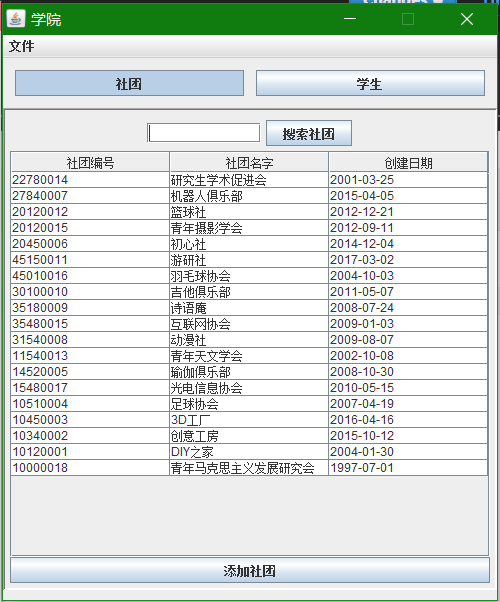
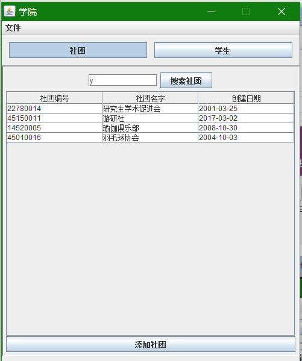
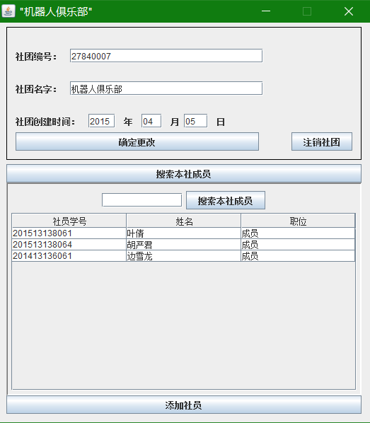
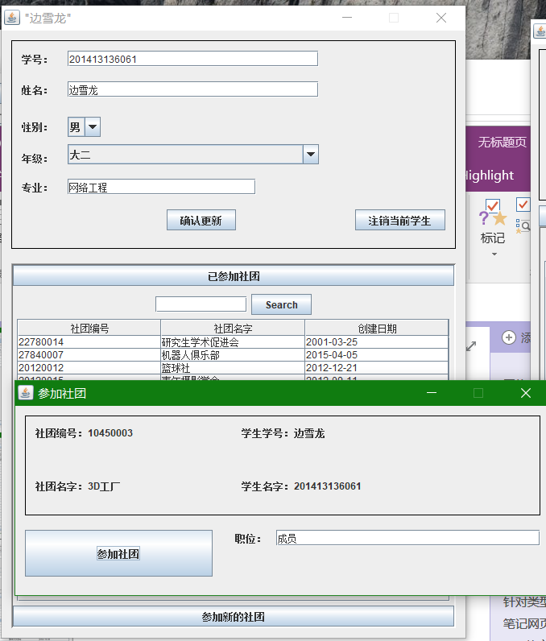
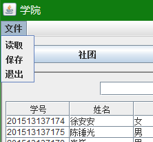

# 学生社团管理系统

## 主界面，分别显示社团和学生，并且支持拼音查询：

## 点击其中的任意一个选项就可以打开对应的社团或者学生的编辑选项：
### 社团编辑：
可查看本社团的成员、添加新的成员、删除成员、修改成员的职位  

### 学生编辑：
可查看这个学生参加过的所有社团、参加新社团、退出社团  

## 文件保存
通过菜单选项来 **读取** 或者 **保存** 所有的数据
数据存储在**saveData/backup/data/\*.dat**文件中。  

## 文件备份
在打开软件的时候，程序会将所有的数据备份在**saveData/backup**文件夹中，这个文件夹的内容不会在当前程序运行的过程中覆盖，也就是说，如果用户在使用的过程中发生了任何意外操作，他可以通过这个备份数据回滚到打开应用的状态。  
但是当下一次打开应用之后，备份数据将会**被新的备份数据覆盖**，使用时请注意。
